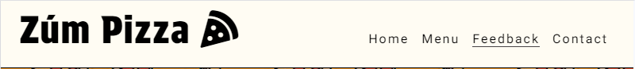
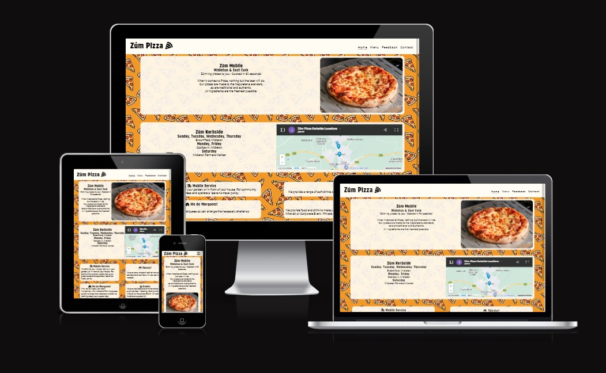
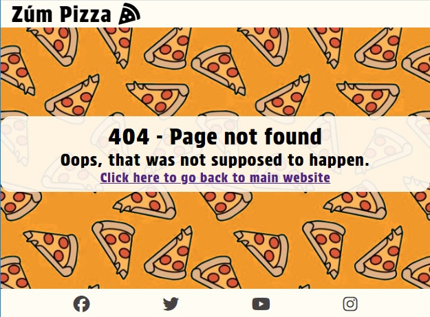
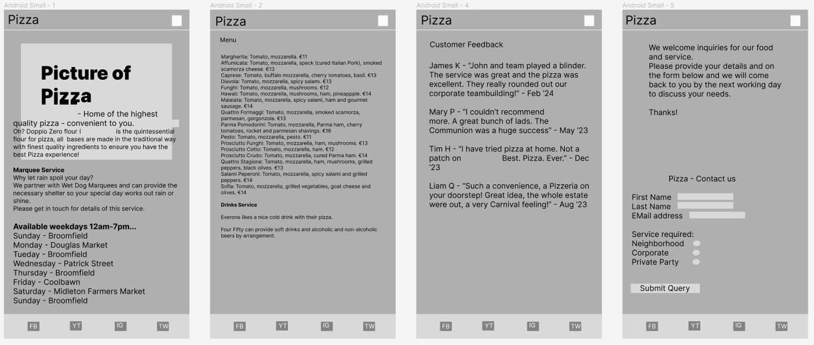

# Zúm Pizza
## Index
* [Repository](#repository)
* [Zúm Pizza](#zúm-Pizza)
* [Site Features](#site-Features)
* [Navigation](#navigation)
* [Wireframe](#wireframe)
* [Testing and Go-live](#testing-and-go-live)
* [Deployment](#deployment)
* [Credits](#credits)

## Repository
([Index](#index))<br>
https://github.com/johnrm/zumpizza


## Zúm Pizza
([Index](#index))<br>
The Client, 'Zúm Pizza',  has requested a website built to showcase products and services.<br>
Zúm Pizza provide pop-up Pizza service on a schedule for localities similar to ice-cream van as well as local markets.<br>
The naming comes from speed at which the pizzas cook.<br>
Zúm Pizza also caters for corporate events and private parties.<br>
Zúm Pizza emphasis is on excellent service and top quality product, this should be reflected in a high-quality and professional website.<br>
Target catchment area is predominately East Cork<br>
The purpose of the website is to establish a presence and showcase services.<br>

## Site features
([Index](#index))<br>
### Site wide
### Navigation

The business name is at the top of each page.<br>
Small displays exhibit a Burger icon which when clicked pops-up clickable page links.
On larger displays a horizontal row of links is shown to the respective page.<br>
### Responsiveness
The site has been tested for responsiveness and works well on mobile phone screen up to HD screen.

### 404 page
A 404 page is included on the site in the event of broken links or missing pages.<br>


### The Menu Page
This page shows sample Pizza combinations with indicative kerbside pricing.<br>
### The Feedback Page
This page shows sample and placeholder feedback from customers.<br>
### The Contact Page
This page allows clients, both current and potential to contact Zúm.<br>
A contact form allows users to get in touch.<br>
The form has the following fields...<br>
First Name (required, type=text)<br>
Last Name (required, type=text)<br>
Phone number (required, type=text)<br>
Email (required, type=email)<br>
Message (required, type=textarea)<br>
On successful submission, the user will be brought to a confirmation page.<br>

## Wireframe
([Index](#index))<br>
Wireframe for Mobile device provided to show onepre-development perspective of the requirement.<br>
<br>

## Testing and Go-live
([Index](#index))<br>
Ensure all images have appropriate alt text.<br>
Ensure all pages are working correctly and responsive.<br>
Ensure all html is validated.<br>
Ensure CSS is validated.<br>
Ensure contact requests are working successfully.<br>

## Deployment
([Index](#index))<br>
Site code sits in Github repository detailed at the head of this document.<br>
The development IDE used is Gitpod.<br>
Code commits are pushed to Github as the code develops with brief relevant comments.<br>
The live public site is published via Github Pages as follows...<br>
In Github, from the Dashboard, navigate to 'johnrm/zumpizza' repository.<br>
Select Settings > Under Code and Automation, select Pages (Github pages)<br>
Under build and deployment, select the 'main' branch.<br>
Click Save.<br>
After a few minutes the site deploys is accessible here...<br>
https://johnrm.github.io/zumpizza/<br>

## Credits
([Index](#index))<br>
Favicons courtesy of favicon.io<br>
Pizza_wallpaper.jpg - Courtesy of Adobe. Art by Ngupakarti<br>
classic-cheese-pizza.webp, mixkit-close-up-shot-of-a-pepperoni-pizza-44001-medium.mp4 courtesy of www.pexels.com<br>

## Validate html and CSS
A feature that was going to go into the site was a live Google Map on the index page to accompany locatons.<br>
While validating I found that it failed.<br>
Code snippet here...<br>

```
            <div id="map">
                <iframe
                src="https://www.google.com/maps/d/embed?mid=1vGMCsnZHs91CGv4S2h5phSu21rrh6fM&hl=en&ehbc=2E312F"
                width="100%" height="250"></iframe>
            </div>
```

width="100%" works but is not valid so I cut the code out.<br>
<br>
All Code and CSS now validates.<br>