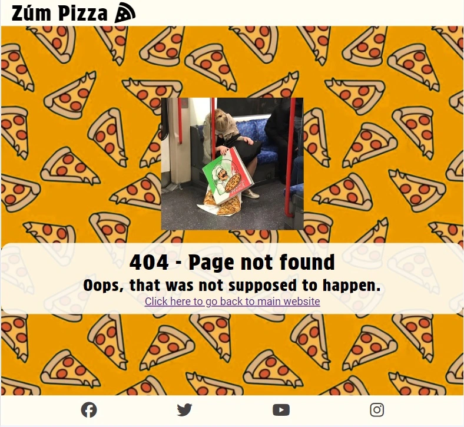

# Zúm Pizza
## Index
* [Repository](#repository)
* [Zúm Pizza](#zúm-pizza)
* [Site Features](#site-features)
* [Wireframe](#wireframe)
* [Testing and Go-live](#testing-and-go-live)
* [Bugs](#bugs)
* [Deployment](#deployment)
* [Credits](#credits)
* [Validate html and CSS](#validate-html-and-css)

## Repository
https://github.com/johnrm/zumpizza
<br>
([Back to top](#index))<br>


## Zúm Pizza
The Client, 'Zúm Pizza',  has requested a website built to showcase products and services.<br>
Zúm Pizza provide pop-up Pizza service on a schedule for localities similar to ice-cream van as well as local markets.<br>
The naming comes from speed at which the pizzas cook.<br>
Zúm Pizza also caters for corporate events and private parties.<br>
Zúm Pizza emphasis is on excellent service and top quality product, this should be reflected in a high-quality and professional website.<br>
Target catchment area is predominately East Cork<br>
The purpose of the website is to establish a presence and showcase services.<br>
<br>
([Back to top](#index))<br>

## Site features
### Navigation

The business name is at the top of each page.<br>
Small displays exhibit a Burger icon which when clicked pops-up clickable page links.
On larger displays a horizontal row of links is shown to the respective page.<br>
### Responsiveness
The site has been tested for responsiveness and works well on mobile phone screen up to HD screen.

### 404 page
A 404 page is included on the site in the event of broken links or missing pages.<br>


### The Home Page
This page contains a lot of detail.<br>
The head of the page contains a synopsised About alongside a typical Pizza.<br>
We then show a list of locations where daily service is available along with a map to help customers find us.<br>
Lastly we present the list of services available.<br>
### The Menu Page
This page shows sample Pizza combinations with indicative kerbside pricing.<br>
This page shows sample Pizza combinations with indicative kerbside pricing.<br>
### The Feedback Page
This page shows sample and placeholder feedback from customers.<br>
This page shows sample and placeholder feedback from customers.<br>
### The Contact Page
This page allows clients, both current and potential to contact Zúm.<br>
This page allows clients, both current and potential to contact Zúm.<br>
A contact form allows users to get in touch.<br>
The form has the following fields...<br>
First Name (required, type=text)<br>
Last Name (required, type=text)<br>
Phone number (required, type=text)<br>
Email (required, type=email)<br>
Message (required, type=textarea)<br>
On successful submission, the user will be brought to a Thank you page...<br>
<br>


## Wireframe
Wireframe for Mobile device provided to show onepre-development perspective of the requirement.<br>
<br>
<br>
([Back to top](#index))<br>

## Testing and Go-live
All pages have been tested on Chrome and Edge and Safari.<br>
Any images have appropriate alt text.<br>
All pages are working correctly and responsive, tested in Chrome DevTools, Desktop, and on a mobile device.<br>
Html has been validated.<br>
CSS ha been validated.<br>
Contact details are validated and requests are working successfully.<br>
<br>
([Back to top](#index))<br>

## Bugs
This was a first project so there were number of bugs in the code.<br>
There were layout issues throughout which were remedied from research online and some trial and error.<br>
This resulted from lack of understanding of Flexbox but this is a lot clearer now.<br>
Flexbox Issues were principally on index.html but have been remedied.<br>
<br>
Foreground text on menu.html was barely visible regardless of font changes.<br>
Updating CSS for '.borderpizza' with 'background-color: rgba(0, 0, 0, .4);' and 'background-blend-mode: multiply;' resolved this.<br>
<br>
Not a bug per se, but there was a Validation issue with iframe which is detailed in Validation section ([here](#validate-html-and-css))<br>
<br>
Again, not a bug but validation of the thanks page was failing as I had width=100% and height=auto on the video element.<br>
Removing these and placing in CSS corrected this.<br>
<br>
([Back to top](#index))<br>

## Deployment
Site code sits in Github repository detailed at the head of this document.<br>
The development IDE used is Gitpod.<br>
Code commits are pushed to Github as the code develops with brief relevant comments.<br>
The live public site is published via Github Pages as follows...<br>
In Github, from the Dashboard, navigate to 'johnrm/zumpizza' repository.<br>
Select Settings > Under Code and Automation, select Pages (Github pages)<br>
Under build and deployment, select the 'main' branch.<br>
Click Save.<br>
After a few minutes the site deploys is accessible here...<br>
https://johnrm.github.io/zumpizza/<br>
<br>
([Back to top](#index))<br>

## Credits
Favicons courtesy of favicon.io<br>
pizza_wallpaper.webp - Courtesy of Adobe. Art by Ngupakarti<br>
uncooked.webp - Courtesy of Adobe<br>
classic-cheese-pizza.webp, mixkit-close-up-shot-of-a-pepperoni-pizza-44001-medium.mp4 courtesy of www.pexels.com<br>
404.webp courtesy of James Longman @JamesAALongman<br>
Social Media code and some small code snippets were taken from CI Love Running Project.<br>
<br>
([Back to top](#index))<br>

## Validate html and CSS
HTML validation was successful with official W3C validator with 1 exception.<br>
<br>
Index.html validation fails on iframe width percentage. However, the code works without issue.

```
                <iframe
                src="https://www.google.com/maps/d/embed?mid=1vGMCsnZHs91CGv4S2h5phSu21rrh6fM&hl=en&ehbc=2E312F"
                width="100%" height="250"></iframe>
```

<br>
<br>
<br>
CSS validation passes the official(Jigsaw) validator but with a warning on Google Fonts...
<br>
<br>
Accessibility score was 100% for accessibility for every page in Lighthouse tools in Chrome Developertools.<br>
index.html<br>
<br>
menu.html<br>
<br>
feedback.html<br>
<br>
contact.html<br>
<br>
thanks.html<br>
<br>
404.html<br>
<br>
<br>
([Back to top](#index))<br>