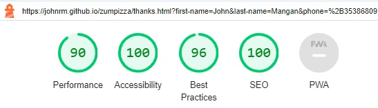

# Zúm Pizza
## Index
* [Live site](#live-site)
* [Zúm Pizza](#zúm-pizza)
* [Site Features](#site-features)
* [Wireframe](#wireframe)
* [Testing](#testing)
* [Bugs](#bugs)
* [Deployment](#deployment)
* [Credits](#credits)
* [Validate html and CSS](#validate-html-and-css)

## Live Site
https://johnrm.github.io/zumpizza/
<br>
([Back to top](#index))<br>

## Zúm Pizza
The Client, 'Zúm Pizza',  has requested a website built to showcase products and services.<br>
Zúm Pizza provide pop-up Pizza service on a schedule for localities similar to ice-cream van as well as local markets.<br>
The naming comes from speed at which the pizzas cook.<br>
Zúm Pizza also caters for corporate events and private parties.<br>
Zúm Pizza emphasis is on excellent service and top quality product, this should be reflected in a high-quality and professional website.<br>
Target catchment area is predominately East Cork<br>
The purpose of the website is to establish a presence and showcase services.<br>
<br>
([Back to top](#index))<br>

## Site features
### Navigation

The business name is at the top of each page.<br>
Small displays exhibit a Burger icon which when clicked pops-up clickable page links.
On larger displays a horizontal row of links is shown to the respective page.<br>
### Responsiveness
The site has been tested for responsiveness and works well on mobile phone screen up to HD screen.

### 404 page
A 404 page is included on the site in the event of broken links or missing pages.<br>


### The Home Page
This page contains a lot of detail.<br>
The head of the page contains a synopsised About alongside a typical Pizza.<br>
We then show a list of locations where daily service is available along with a map to help customers find us.<br>
Lastly we present the list of services available.<br>
### The Menu Page
This page shows sample Pizza combinations with indicative kerbside pricing.<br>
This page shows sample Pizza combinations with indicative kerbside pricing.<br>
### The Feedback Page
This page shows sample and placeholder feedback from customers.<br>
This page shows sample and placeholder feedback from customers.<br>
### The Contact Page
This page allows clients, both current and potential to contact Zúm.<br>
This page allows clients, both current and potential to contact Zúm.<br>
A contact form allows users to get in touch.<br>
The form has the following fields...<br>
First Name (required, type=text)<br>
Last Name (required, type=text)<br>
Phone number (required, type=text)<br>
Email (required, type=email)<br>
Message (required, type=textarea)<br>
On successful submission, the user will be brought to a Thank you page...<br>
<br>


## Wireframe
Wireframe for Mobile device provided to show onepre-development perspective of the requirement.<br>
<br>
<br>
([Back to top](#index))<br>

## Testing 

### Responsiveness
All pages were tested to ensure responsiveness on screen sizes from 320px and upwards as defined in [WCAG 2.1 Reflow criteria for responsive design](https://www.w3.org/WAI/WCAG21/Understanding/reflow.html) on Chrome, Edge, Firefox and Opera browsers.

Steps to test:
1. Open browser and navigate to [Zúm Pizza](https://johnrm.github.io/zumpizza/)
2. Open the developer tools (right click and inspect)
3. Set to responsive and decrease width to 320px
4. Set the zoom to 50%
5. Click and drag the responsive window to maximum width

Expected:
Website is responsive on all screen sizes and no images are pixelated or stretched.
No horizontal scroll is present.
No elements overlap.

Actual:
All behaviour is as expected

Website was also opened on the following devices and no responsive issues were seen:
- Google Pixel 4
- Samsung Galaxy A52
- Samsung Galaxy Tablet

### Accessibility

[Wave Accessibility](https://wave.webaim.org/) tool was used throughout development and for final testing of the deployed website to check for any aid accessibility testing.

Testing was focused to ensure the following criteria were met:

- All forms have associated labels or aria-labels so that this is read out on a screen reader to users who tab to form inputs
- Color contrasts meet a minimum ratio as specified in [WCAG 2.1 Contrast Guidelines](https://www.w3.org/WAI/WCAG21/Understanding/contrast-minimum.html)
- Heading levels are not missed or skipped to ensure the importance of content is relayed correctly to the end user
- All content is contained within landmarks to ensure ease of use for assistive technology, allowing the user to navigate by page regions
- All not textual content had alternative text or titles so descriptions are read out to screen readers
- HTML page lang attribute has been set
- Aria properties have been implemented correctly
- WCAG 2.1 Coding best practices being followed

Manual tests were also performed to ensure the website was as accessible as possible.

### Lighthouse Testing
Accessibility score was 100% for accessibility for every page in Lighthouse tools in Chrome Developertools.<br>
index.html<br>
<br>
menu.html<br>
<br>
feedback.html<br>
<br>
contact.html<br>
<br>
thanks.html<br>
<br>
404.html<br>
<br>
<br>

### Functional Testing

**Navigation Links**

Testing was performed to ensure all navigation links on the respective pages navigated to the correct pages as per design. This was done by clicking on the navigation links on each page.

| Navigation Link | Page to Load    |
| --------------- | --------------- |
| Home            | index.html      |
| Menu            | menu.html       |
| Feedback        | feedback.html   |
| Contact         | contact.html    |

Links on all pages navigated to the correct pages as expected.

**Form Testing**

The contact page was tested to ensure functionality was as expected for both correct and incorrect data input as follows...

**Test one - Correct Inputs**

Steps to test:

1. Navigate to [Zúm Pizza - Contact Page](https://johnrm.github.io/zumpizza/contact.html)
2. On the form input the following data:
   - First Name: John
   - Last Name: Doe
   - Phone number: 01-234 5678
   - Email: john.doe@test.com
   - Comment: This is a test
3. Click Submit

Expected:
The form submits with no warnings or errors and user is redirected to thanks.html confirmation page.

Actual:
Website behaved as expected with no errors or warnings and redirected to thanks.html.

**Test Two - Missing Required Field First Name**

Steps to test:

1. Navigate to [Zúm Pizza - Contact Page](https://johnrm.github.io/zumpizza/contact.html)
2. On the form input the following data:
   - First Name:
   - Last Name: Doe
   - Phone number: 01-234 5678
   - Email: john.doe@test.com
   - Comment: This is a test.
3. Click Submit

Expected:
The form does not submit and an message 'Please fill out this field' is displayed to tell the user that the field is required.

Actual:
Website behaved as expected, error message was displayed and the form did not submit.

**Test Three - Missing Required Field Last Name**

Steps to test:

1. Navigate to [Zúm Pizza - Contact Page](https://johnrm.github.io/zumpizza/contact.html)
2. On the form input the following data:
   - First Name: John
   - Last Name:
   - Phone number: 01-234 5678
   - Email: john.doe@test.com
   - Comment: This is a test.
3. Click Submit

Expected:
The form does not submit and an message 'Please fill out this field' is displayed to tell the user that the field is required.

Actual:
Website behaved as expected, error message was displayed and the form did not submit.

**Test Four - Missing Required Field Email**

Steps to test:
1. Navigate to [Zúm Pizza - Contact Page](https://johnrm.github.io/zumpizza/contact.html)
2. On the form input the following data:
   - First Name: John
   - Last Name: Doe
   - Phone number: 01-234 5678
   - Email:
   - Comment: This is a test.
3. Click Submit

Expected:
The form does not submit and an message 'Please fill out this field' is displayed to tell the user that the field is required.

Actual:
Website behaved as expected, error message was displayed and the form did not submit.

**Test Five - Incorrect email format**

Steps to test:

1. Navigate to [Zúm Pizza - Contact Page](https://johnrm.github.io/zumpizza/contact.html)
2. On the form input the following data:
   - First Name: John
   - Last Name: Doe
   - Phone number: 01-234 5678
   - Email: john.doetest.com
   - Comment: This is a test.
3. Click Submit

Expected:
The form does not submit and an Error is displayed to tell the user that a valid email is required and the format it should be in.

Actual:
Website behaved as expected, error message was displayed and the form did not submit.

**Footer Social Media Icons / Links**

Testing was performed on the Font Awesome Social Media icons in the footer to ensure that each one opened in a new tab.

Each item opened a new tab when clicked as expected and correct hover color was present.

Testing was performed on the phone number in the contact information section of the footer to ensure behaviour was as expected.

**Test Phone Number**

1. Navigate to [Zúm Pizza - Contact Page](https://johnrm.github.io/zumpizza/contact.html)
2. Click the phone number - 086 123 4567

Expected:
A window is opened asking which applicatin you would like to call from.

Actual:
Behavior was as expected and the window presented an application picker.


**Test Email Link**
1. Navigate to [Zúm Pizza - Contact Page](https://johnrm.github.io/zumpizza/contact.html)
2. Click the email address (tasty@zum.pizza)

Expected:
A windows popup is displayed asking what application you would like to send a mail from or your default email application is opened.

Actual:
Behavior was as expected and Windows default email application was opened ready to send an email to the target address.
<br>
([Back to top](#index))<br>

## Bugs
This was a first project so there were number of bugs in the code.<br>
There were layout issues throughout which were remedied from research online and some trial and error.<br>
This resulted from lack of understanding of Flexbox but this is a lot clearer now.<br>
Flexbox Issues were principally on index.html but have been remedied.<br>
<br>
Foreground text on menu.html was barely visible regardless of font changes.<br>
Updating CSS for '.borderpizza' with 'background-color: rgba(0, 0, 0, .4);' and 'background-blend-mode: multiply;' resolved this.<br>
<br>
Not a bug per se, but there was a Validation issue with iframe which is detailed in Validation section ([here](#validate-html-and-css))<br>
<br>
Again, not a bug but validation of the thanks page was failing as I had width=100% and height=auto on the video element.<br>
Removing these and placing in CSS corrected this.<br>
<br>
([Back to top](#index))<br>

## Deployment
Site code sits in this Github repository<br>
The development IDE used is Gitpod.<br>
Code commits are pushed to Github as the code develops with brief relevant comments.<br>
The live public site is published via Github Pages as follows...<br>
In Github, from the Dashboard, navigate to 'johnrm/zumpizza' repository.<br>
Select Settings > Under Code and Automation, select Pages (Github pages)<br>
Under build and deployment, select the 'main' branch.<br>
Click Save.<br>
After a few minutes the site deploys is accessible here...<br>
https://johnrm.github.io/zumpizza/<br>
<br>
([Back to top](#index))<br>

## Credits

Favicons courtesy of favicon.io

pizza_wallpaper.webp - Courtesy of Adobe. Art by Ngupakarti

uncooked.webp - Courtesy of Adobe

classic-cheese-pizza.webp, mixkit-close-up-shot-of-a-pepperoni-pizza-44001-medium.mp4 courtesy of www.pexels.com

404.webp courtesy of James Longman @JamesAALongman

Social Media code and some small code snippets were taken from CI Love Running Project.

([Back to top](#index))<br>

## Validate html and CSS
HTML validation was successful with official W3C validator with 1 exception.<br>
<br>
Index.html validation fails on iframe width percentage. However, the code works without issue.

```
                <iframe
                src="https://www.google.com/maps/d/embed?mid=1vGMCsnZHs91CGv4S2h5phSu21rrh6fM&hl=en&ehbc=2E312F"
                width="100%" height="250"></iframe>
```

<br>
<br>
<br>
CSS validation passes the official(Jigsaw) validator but with a warning on Google Fonts...
<br>
<br>
([Back to top](#index))<br>